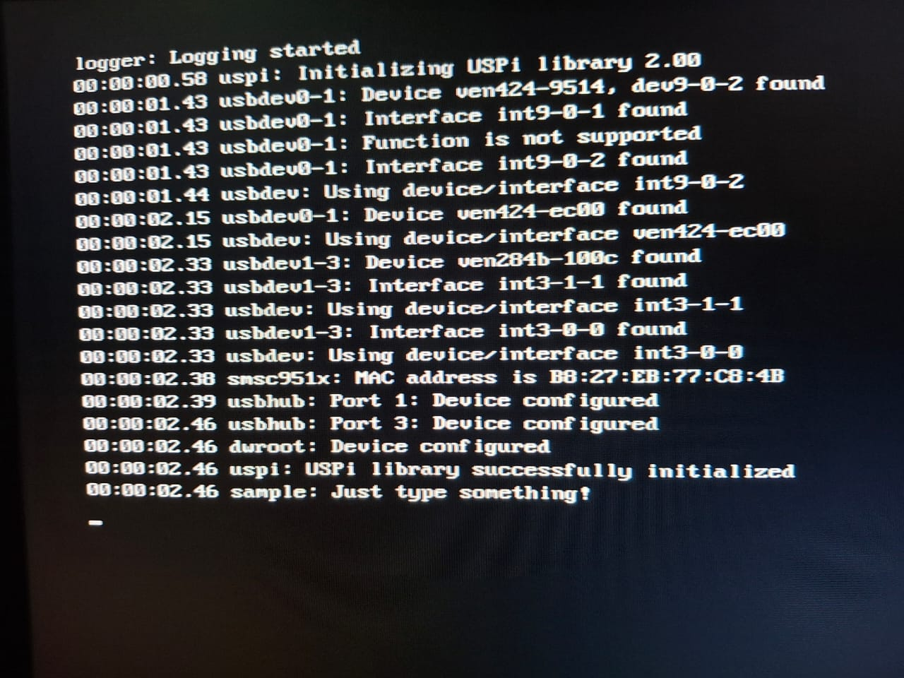

# Low Level Tetris
A Tetris game coded in C, running directly on bare metal Raspberry Pi 2. No OS, direct hardware control for graphics and input.

## USPi

USPi is an USB driver for Raspberry Pi written in C. Here is the original repository: [USPi](https://github.com/rsta2/uspi)

USPi is used with little adaptations in our Low Level Tetris project. The needed files are inside the `uspi` directory.

## Compile Tests

```bash
g++ -o tests/tetris tests/tetris.c -I/usr/local/include/SDL2 -L/usr/local/lib -lSDL2
```

## Generate .img file

The USPi driver is adapted here to work by default for the Raspberry Pi 2. For that, just simply use the `makeall` script

```bash
./makeall
```

It is also possible to use it for the Raspberry Pi 3 (32 bit architecture):

```bash
./makeall RASPPI=3 
```

To remove all the generated files:
```bash
./makeall clean
```

## Logging

The USPi driver contains logging on the initialization of the driver, showing relevant messages related to the keyboard integration. 

For example, for a successful connection:



By default, we left logging disabled. If it is wanted to enable the logging, the makeall command should be the following:

```bash
./makeall LOGGING=1 DEBUG=1 
```

Or, for the Raspberry Pi 3:
```bash
./makeall RASPPI=3 LOGGING=1 DEBUG=1 
```